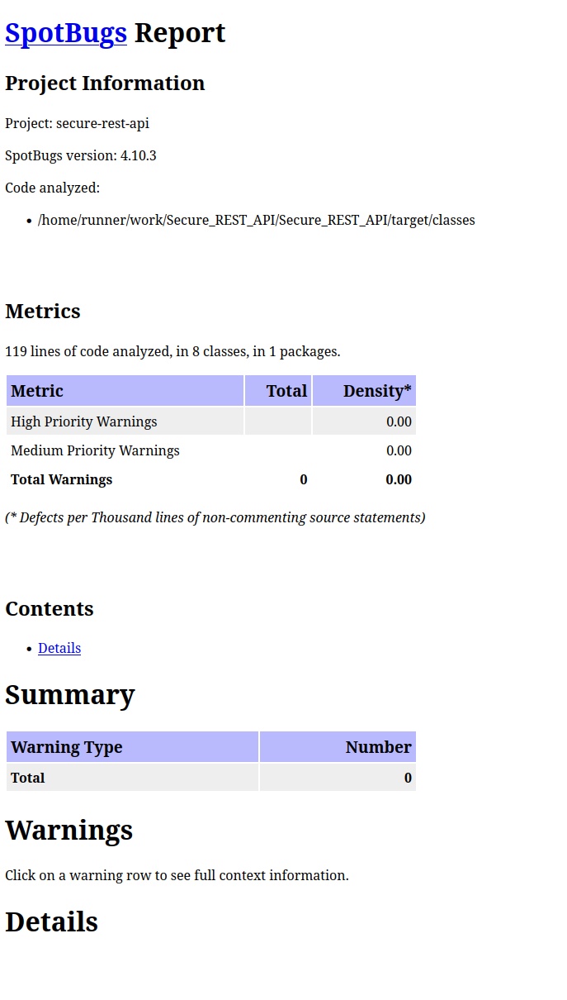
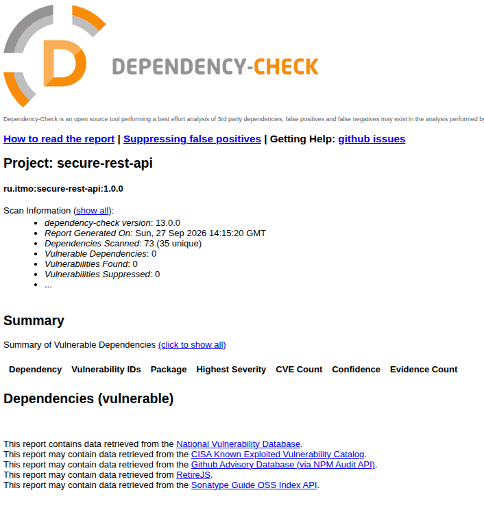

# Secure REST API

Учебный REST API на Java и Spring Boot с аутентификацией по JWT и хранением данных в H2.

## Запуск

Требуются Java 21 и Maven.

```bash
APP_PASSWORD='your-password' mvn spring-boot:run
```

Приложение доступно по адресу `http://localhost:8080`. Логин по умолчанию `demo`. Его можно изменить переменной окружения `APP_USERNAME`.

H2 работает в памяти: после перезапуска записи удаляются. Ключ подписи JWT также создаётся при запуске, поэтому ранее выданные токены после перезапуска перестают действовать.

## API

| Метод | Адрес | Назначение | Доступ |
|---|---|---|---|
| POST | `/auth/login` | Получить JWT | Без токена |
| GET | `/api/data` | Получить записи | С токеном |
| POST | `/api/data` | Добавить запись | С токеном |

### Получение токена

```bash
curl -X POST http://localhost:8080/auth/login \
  -H "Content-Type: application/json" \
  -d '{"username":"demo","password":"your-password"}'
```

Ответ содержит поле `token`. При неверных учётных данных сервер возвращает `401 Unauthorized`.

### Получение записей

```bash
curl http://localhost:8080/api/data \
  -H "Authorization: Bearer ВСТАВЬТЕ_JWT"
```

### Добавление записи

```bash
curl -X POST http://localhost:8080/api/data \
  -H "Authorization: Bearer ВСТАВЬТЕ_JWT" \
  -H "Content-Type: application/json" \
  -d '{"text":"Новая запись"}'
```

При успешном добавлении сервер возвращает `201 Created`. Без действительного токена защищённые эндпоинты возвращают `401 Unauthorized`.

## Проверки безопасности

GitHub Actions запускается при `push` и создании pull request. Pipeline выполняет сборку Maven, статический анализ SpotBugs и проверку зависимостей OWASP Dependency-Check. Сборка завершается ошибкой при обнаружении зависимости с оценкой CVSS от 7.

[Последний успешный запуск CI](https://github.com/SaveliyDanko/Secure_REST_API/actions/runs/36325811652)

Отчёты доступны в артефакте `security-reports` на странице запуска.




